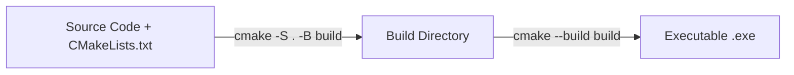

# Mengenal CMake & Build System Terminal

## Apa yang akan kita bahas?

Pada bab ini, kita akan mempelajari bagaimana cara mengonfigurasi **CMake** untuk project Win32. Kita akan memahami struktur file `CMakeLists.txt`, apa itu subsystem Windows vs Console, serta bagaimana cara mem-build program langsung dari terminal hanya dengan dua baris perintah.

---

## Mengapa Menggunakan CMake?

Jika kita mengompilasi program C++ secara manual dari baris perintah MSVC, kita harus mengetikkan parameter yang panjang:

```powershell
# Cara manual yang merepotkan:
cl.exe /EHsc /W4 /DUNICODE /D_UNICODE main.cpp /link user32.lib gdi32.lib /SUBSYSTEM:WINDOWS
```

Dengan **CMake**, semua aturan kompilasi, penentuan library, dan pengaturan subsystem ditulis di dalam satu file bernama `CMakeLists.txt`. CMake akan menghasilkan file build resmi yang siap dieksekusi secara otomatis dan konsisten di mesin mana pun.

---

## Anatomi `CMakeLists.txt` untuk Win32

Berikut adalah file `CMakeLists.txt` minimal tetapi lengkap untuk aplikasi GUI Win32:

```cmake
# 1. Tentukan versi minimal CMake yang didukung
cmake_minimum_required(VERSION 3.20)

# 2. Definisikan nama project dan bahasa pemrograman
project(HelloWin32 LANGUAGES CXX)

# 3. Tetapkan standar C++ modern (C++20 disarankan)
set(CMAKE_CXX_STANDARD 20)
set(CMAKE_CXX_STANDARD_REQUIRED ON)

# 4. Aktifkan dukungan Unicode di seluruh project
add_compile_definitions(UNICODE _UNICODE)

# 5. Buat executable dengan flag WIN32
add_executable(HelloWin32 WIN32
    main.cpp
)

# 6. Hubungkan (link) library Windows yang dibutuhkan
target_link_libraries(HelloWin32 PRIVATE
    user32
    gdi32
)
```

---

## Penjelasan Bagian Penting

### 1. Apa Maksud Flag `WIN32` di `add_executable`?
Perhatikan baris ini:
```cmake
add_executable(HelloWin32 WIN32 main.cpp)
```

Flag `WIN32` memberitahu linker compiler MSVC untuk menggunakan flag `/SUBSYSTEM:WINDOWS`. 

| Subsystem | Perilaku Saat Dijalankan | Entry Point yang Dicari Compiler |
| :--- | :--- | :--- |
| **CONSOLE** (Default tanpa flag WIN32) | Membuka jendela terminal/CMD hitam di belakang aplikasi | `int main(int argc, char* argv[])` |
| **WINDOWS** (Dengan flag WIN32) | Berjalan sebagai aplikasi GUI murni **tanpa** terminal hitam | `int WINAPI wWinMain(...)` |

Jika kamu ingin membuat aplikasi desktop yang bersih tanpa jendela command prompt hitam yang tiba-tiba muncul di belakang layar, flag `WIN32` ini wajib digunakan.

### 2. Kenapa Menghubungkan `user32` dan `gdi32`?
* **`user32.lib`**: Berisi implementasi fungsi jendela tingkat tinggi, manajemen pesan, kursor, dan dialog (seperti `CreateWindowExW`, `RegisterClassExW`, `MessageBoxW`, `GetMessageW`).
* **`gdi32.lib`**: Singkatan dari *Graphics Device Interface*, pustaka untuk menggambar teks, garis, warna, dan bentuk grafis ke layar.

---

## Alur Dua Langkah Build Menggunakan CMake

CMake bekerja dengan dua tahap sederhana:



### Tahap 1: Konfigurasi (*Generate Build Files*)
Jalankan perintah ini di root folder project:
```powershell
cmake -S . -B build
```
* `-S .`: Menunjuk ke folder saat ini (*Source directory*) tempat `CMakeLists.txt` berada.
* `-B build`: Folder tujuan (*Binary/Build directory*) tempat seluruh file sementara dan file solusi proyek akan dibuat.

### Tahap 2: Kompilasi (*Build*)
Setelah konfigurasi selesai, jalankan kompilasi:
```powershell
cmake --build build
```
CMake akan memanggil compiler MSVC untuk mengompilasi kode dan menghasilkan file `.exe` di dalam folder `build/Debug/` (atau `build/`).

---

## Menjalankan Executable

Setelah build selesai dengan sukses, jalankan aplikasimu langsung dari PowerShell:
```powershell
.\build\Debug\HelloWin32.exe
```

---

## Materi Selanjutnya

Sekarang kita sudah paham cara kerja compiler dan build system CMake. Sebelum kita menulis jendela pertama kita, mari kita pelajari tipe data khusus dan aturan string Unicode di Windows C++.

👉 [Lanjut ke: 01. Tipe Data Windows (HWND, DWORD, dll)](/01-cpp-dasar/01-tipe-data-windows)
