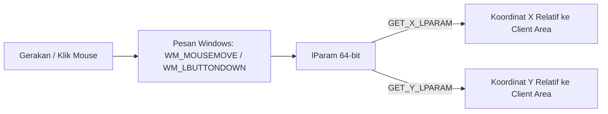

# Mouse Input & Tracking

## Apa yang akan kita buat?

Pada bab ini, kita akan mempelajari cara melacak pergerakan kursor mouse di dalam jendela aplikasi, membaca koordinat (X, Y) secara presisi, mendeteksi tombol klik kiri/kanan, serta memahami konsep *mouse capture* saat menggeser (*drag*) elemen.

---

## Konsep yang Perlu Dipahami

Setiap kali kursor mouse bergerak atau tombol mouse ditekan di atas area jendela kita (*client area*), Windows mengirimkan pesan dengan koordinat piksel yang dikemas di dalam parameter `lParam`.



---

## Membaca Koordinat Mouse dari `lParam`

Koordinat mouse dikemas dalam dua bagian 16-bit:
* **Bagian Bawah (Low-order word)**: Koordinat horizontal **X**.
* **Bagian Atas (High-order word)**: Koordinat vertikal **Y**.

Untuk mengekstraknya secara aman, **selalu sertakan header `<windowsx.h>`** dan gunakan macro resmi:

```cpp
#include <windows.h>
#include <windowsx.h> // Wajib untuk macro koordinat mouse

case WM_MOUSEMOVE:
{
    int xPos = GET_X_LPARAM(lParam);
    int yPos = GET_Y_LPARAM(lParam);

    // Minta Windows menggambar ulang jendela agar lingkaran/kursor kustom berpindah
    InvalidateRect(hwnd, nullptr, TRUE);
    return 0;
}
```

> [!WARNING] Kenapa Harus `GET_X_LPARAM` Bukan `LOWORD`?
> Pada setup multi-monitor (lebih dari satu layar), monitor kedua yang berada di sebelah kiri monitor utama akan memiliki koordinat **negatif**. Macro lama `LOWORD` menghasilkan bilangan *unsigned* sehingga angka negatif akan rusak menjadi bilangan miliaran. Macro `GET_X_LPARAM` menghasilkan bilangan *signed* yang benar.

---

## Daftar Pesan Mouse yang Sering Digunakan

| Pesan Windows | Kejadian yang Memicu |
| :--- | :--- |
| **`WM_MOUSEMOVE`** | Kursor mouse digeser di dalam client area |
| **`WM_LBUTTONDOWN`** | Tombol kiri mouse ditekan |
| **`WM_LBUTTONUP`** | Tombol kiri mouse dilepas |
| **`WM_RBUTTONDOWN`** | Tombol kanan mouse ditekan (biasanya untuk context menu) |
| **`WM_RBUTTONUP`** | Tombol kanan mouse dilepas |
| **`WM_MOUSEWHEEL`** | Roda scroll mouse diputar (nilai putaran ada di `GET_WHEEL_DELTA_WPARAM(wParam)`) |

---

## Konsep Penting: *Mouse Capture* (`SetCapture` & `ReleaseCapture`)

Secara default, jika pengguna mengklik tombol kiri mouse di dalam jendela lalu menyeret (*drag*) mouse keluar dari area jendela kita, pesan `WM_MOUSEMOVE` dan `WM_LBUTTONUP` **tidak akan lagi dikirimkan** ke jendela kita karena mouse sudah berada di luar area.

Akibatnya, aplikasi tidak tahu kapan pengguna melepas klik mouse!

Untuk mengunci penangkapan mouse selama proses drag:

```cpp
case WM_LBUTTONDOWN:
    // Kunci seluruh input mouse ke jendela ini bahkan jika kursor keluar dari layar
    SetCapture(hwnd);
    break;

case WM_LBUTTONUP:
    // Lepaskan kuncian mouse saat klik dilepas
    ReleaseCapture();
    break;
```

Fitur ini sangat penting saat kita membangun kontrol slider, pemilih warna kustom, maupun custom title bar.

---

## Contoh Proyek Lengkap: `02-input-keyboard-mouse`

Kamu bisa mencoba contoh interaktif yang menggabungkan seluruh konsep keyboard dan mouse di direktori:
```text
examples/02-input-keyboard-mouse/
├── CMakeLists.txt
└── main.cpp
```

### Cara Build & Menjalankan:
```powershell
cmake -S . -B build
cmake --build build
.\build\examples\02-input-keyboard-mouse\Debug\input_app.exe
```

Di aplikasi ini, kamu bisa:
1. Menggerakkan mouse: lingkaran pelacak akan mengikuti kursor dan koordinat (X, Y) ditampilkan secara live.
2. Mengklik tombol kiri mouse: lingkaran akan membesar dan berubah warna menjadi merah terang.
3. Menekan tombol apa saja di keyboard: nama tombol, kode virtual key, dan karakter Unicode yang dihasilkan akan ditampilkan di layar.

---

## Materi Selanjutnya

Sekarang aplikasi kita sudah bisa menerima input pengguna dengan lancar. Di modul berikutnya, kita akan mendalami bagaimana menggambar teks, bentuk bangun datar, dan warna kustom menggunakan **Graphics Device Interface (GDI)** serta teknik **Double Buffering** agar tampilan tidak berkedip (*flicker*).

👉 [Lanjut ke: 01. WM_PAINT & Device Context (HDC)](/05-rendering/01-hdc-dan-paint)
