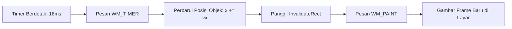

# Timer & Animasi di Win32 (SetTimer & WM_TIMER)

## Apa yang akan kita buat?

Pada bab ini, kita akan mempelajari cara membuat objek bergerak dan beranimasi di layar menggunakan fasilitas **Windows Timer**. Kita akan memahami cara memasang timer dengan interval tertentu, menangani pesan `WM_TIMER`, dan membersihkannya saat aplikasi ditutup.

---

## Konsep Siklus Animasi Komputer

Sebuah animasi pada dasarnya adalah ilusi mata yang dihasilkan dari menggambar serangkaian gambar diam (*frames*) secara berulang-ulang dengan sangat cepat.



Untuk mencapai animasi yang mulus secepat **60 Frame Per Detik (FPS)**:
$$\text{Interval} = \frac{1000 \text{ ms}}{60} \approx 16.6 \text{ ms}$$

---

## Memasang Timer: `SetTimer`

Untuk meminta Windows membangunkan aplikasi kita setiap interval waktu tertentu:

```cpp
UINT_PTR timerId = 1;
UINT intervalMs  = 16; // Setiap 16 milidetik (~60 FPS)

SetTimer(
    hwnd,       // Handle window penerima
    timerId,    // ID unik untuk timer ini (misal: 1)
    intervalMs, // Durasi interval dalam milidetik
    nullptr     // Callback khusus (nullptr = kirim sebagai pesan WM_TIMER ke WindowProc)
);
```

Biasanya `SetTimer` dipanggil tepat setelah `CreateWindowExW` atau di dalam penanganan pesan `WM_CREATE`.

---

## Menangani Pesan `WM_TIMER`

Di dalam `WindowProc`, periksa apakah pesan berasal dari timer yang kita pasang:

```cpp
case WM_TIMER:
{
    if (wParam == 1) // wParam berisi ID Timer
    {
        // 1. Perbarui logika posisi (fisika)
        bolaX += kecepatanX;
        bolaY += kecepatanY;

        // 2. Pantulkan jika menabrak dinding batas jendela
        RECT rc;
        GetClientRect(hwnd, &rc);
        if (bolaX < 0 || bolaX > rc.right)  kecepatanX = -kecepatanX;
        if (bolaY < 0 || bolaY > rc.bottom) kecepatanY = -kecepatanY;

        // 3. Minta Windows menggambar ulang frame baru
        InvalidateRect(hwnd, nullptr, FALSE);
    }
    return 0;
}
```

---

## Mematikan Timer: `KillTimer`

Timer menggunakan sumber daya sistem operasi. Kapan pun jendela ditutup atau animasi berhenti, kamu wajib mematikan timer:

```cpp
case WM_DESTROY:
    KillTimer(hwnd, 1); // Matikan timer dengan ID 1
    PostQuitMessage(0);
    return 0;
```

---

## Masalah Kedipan Layar (*Screen Flickering*)

Saat kamu mulai membuat animasi dengan menggambar langsung di `WM_PAINT`, kamu akan menyadari sebuah masalah visual yang sangat mengganggu: **layar tampak berkedip-kedip putih (*flickering*)**.

Mengapa ini terjadi dan bagaimana solusinya? Mari kita pelajari teknik penyelamat grafis: **Double Buffering**.

👉 [Lanjut ke: 04. Double Buffering (Mencegah Flicker)](/05-rendering/04-double-buffering)
