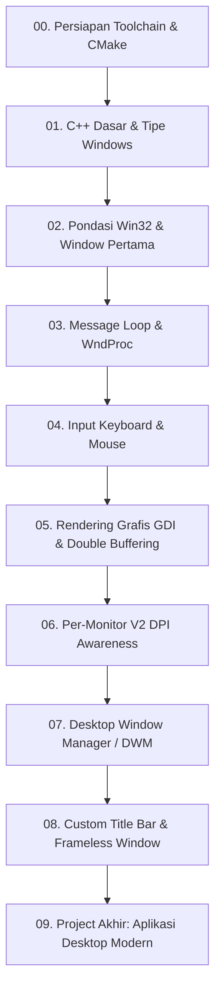

# Roadmap Pembelajaran Win32 + DWM Indonesia

Roadmap ini dirancang secara sistematis agar siapa pun yang baru belajar tidak merasa bingung atau kewalahan. Kita mulai dari dasar sistem operasi Windows sebelum melangkah ke fitur grafis dan modifikasi Desktop Window Manager (DWM).

---

## Modul Pembelajaran

### 00. Persiapan & Lingkungan Pengembangan
- [x] [Kenapa Belajar Win32 & DWM?](/00-persiapan/01-kenapa-win32)
- [x] [Setup Toolchain (MSVC, Windows SDK, Git)](/00-persiapan/02-setup-toolchain)
- [x] [Mengenal CMake & Build System Terminal](/00-persiapan/03-cmake-dan-ninja)

### 01. C++ Dasar yang Diperlukan Win32
- [x] [Tipe Data Primitif Windows (DWORD, BOOL, UINT, WPARAM, LPARAM)](/01-cpp-dasar/01-tipe-data-windows)
- [x] [Unicode & String di Windows (char vs wchar_t, L"string", UTF-16)](/01-cpp-dasar/02-unicode-dan-string)
- [x] [Handle, Pointer & Konvensi Panggilan (HINSTANCE, HWND, CALLBACK, WINAPI)](/01-cpp-dasar/03-handle-dan-pointer)

### 02. Pondasi Win32 & Window Pertama
- [x] [Arsitektur Aplikasi Desktop Windows](/02-win32-dasar/01-arsitektur-win32)
- [x] [Entry Point Aplikasi: wWinMain](/02-win32-dasar/02-entry-point-wWinMain)
- [x] [Mendaftarkan Window Class (WNDCLASSEXW)](/02-win32-dasar/03-window-class)
- [x] [Membuat & Menampilkan Window (CreateWindowExW & ShowWindow)](/02-win32-dasar/04-membuat-window)

### 03. Message Loop & Event Handling
- [x] [Konsep Event-Driven di Windows](/03-message-loop/01-konsep-event-driven)
- [x] [Bedah Tuntas Message Loop (GetMessage, TranslateMessage, DispatchMessage)](/03-message-loop/02-message-loop-detail)
- [x] [Anatomi Window Procedure (WndProc & DefWindowProcW)](/03-message-loop/03-wndproc-anatomi)

### 04. Input Keyboard & Mouse
- [x] [Keyboard Input: WM_KEYDOWN, WM_KEYUP, WM_CHAR, dan Virtual Key Codes](/04-input/01-keyboard)
- [x] [Mouse Input: Koordinat mouse, GET_X_LPARAM, GET_Y_LPARAM, dan Mouse Capture](/04-input/02-mouse)

### 05. Rendering & Grafis (GDI)
- [x] [Anatomi WM_PAINT, BeginPaint, EndPaint, dan Device Context (HDC)](/05-rendering/01-hdc-dan-paint)
- [x] [Menggambar Bentuk, Teks, Warna, Kuas (HBRUSH), dan Pena (HPEN)](/05-rendering/02-gdi-dasar)
- [x] [Timer & Animasi: SetTimer, KillTimer, dan Animasi 60 FPS](/05-rendering/03-timer-dan-animasi)
- [x] [Double Buffering dengan Memory DC untuk Mencegah Layar Berkedip (Flicker)](/05-rendering/04-double-buffering)

### 06. DPI Awareness & Multi-Monitor
- [x] [Per-Monitor V2 DPI Awareness: Mencegah Tampilan Buram di Layar 4K/High-DPI](/06-dpi/01-per-monitor-dpi)

### 07. Desktop Window Manager (DWM)
- [x] [Pengenalan Komposisi DWM & GPU Compositor Windows](/07-dwm/01-pengenalan-dwm)
- [x] [Client Area vs Non-Client Area](/07-dwm/02-client-vs-nonclient)
- [x] [DwmExtendFrameIntoClientArea & Menghidupkan Kembali Native Drop Shadow](/07-dwm/03-dwm-extend-frame)
- [x] [Dark Mode Immersive & Atribut Visual Modern Windows 11](/07-dwm/04-dark-mode-dan-backdrop)

### 08. Custom Title Bar & Frameless Window
- [x] [Menghilangkan Frame Default Windows (WM_NCCALCSIZE Tanpa WS_POPUP)](/08-custom-titlebar/01-frameless-window)
- [x] [Hit Testing (WM_NCHITTEST: HTCAPTION, HTCLIENT, Border Resizing)](/08-custom-titlebar/02-hit-testing)
- [x] [Tombol Kontrol Kustom (Minimize, Maximize, Close dengan Efek Hover)](/08-custom-titlebar/03-caption-buttons)
- [x] [Integrasi Windows 11 Snap Layouts & Batas Work Area Taskbar](/08-custom-titlebar/04-snap-layouts-resizing)

### 09. Project Akhir: Aplikasi Desktop Modern
- [x] [Octanio Win32 Shell: Aplikasi Desktop Dashboard Modern Win32 + DWM Utuh](/09-project/01-modern-app)
